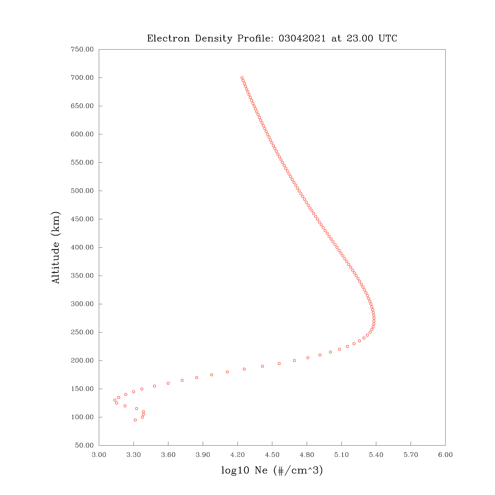
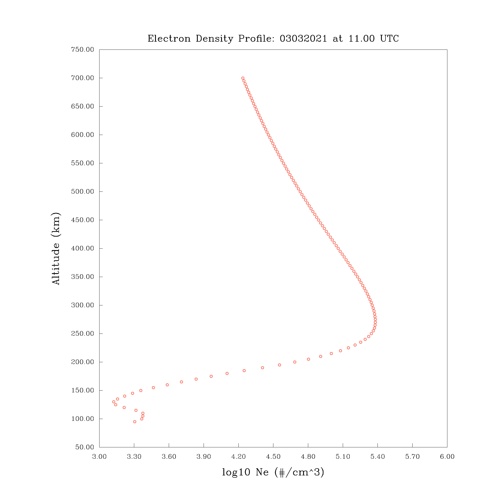

# Assessment: IRI EDP

### Description (original problem statement)

> Create a C-based modeling and simulation program that drive IRI model Fortran code. The code should capture and generate vertical EDP (Electron Density Profile) for a given time and location of interest.
> time of interest: Mar 3 2021 UT 11:00:00 and Mar 4, 2021 UT 23:00:00 location o interest: Lat 37.8N and Lon 75.4W
> Assessment Criteria:
> 1) Create a simple Makefile that can compile iri2016 (http://irimodel.org) and generate a shared object/library
> 2) Write a C-program that links with the shared object created and create all data needed for step (3)
> 3) Use gnuplot (www.gnuplot.info) or other similar C-based plotting tools to generate plots of EDP parameters using the shared objective created in step 1.
> 4) alternatively, use F2PY (https://www.numfys.net/howto/F2PY/) and Python to create EDP plots using the shared object created in step 1. (Although C-based plotting is the preferred solution)
> 5) Furnish instructions/documentation, etc. on how to run the code and lesson/insights learned by doing this exercise.


### Approach

A C driver for the IRI program was created by writing a very thin wrapper around the fortran IRI test program *iritest.for* which is distributed with the IRI model at [irimodel.or](http://irimodel.org/) website (version IRI-2020 of the model was used for this exercise). The *iritest.for* program was used to create a subroutine to provide an api for the C driver program by hard coding all of the IRI model input parameters except for the date and time, which are the only parameters to be varied for the project. The resulting fortran subroutine has the following call signature:

```
SUBROUTINE IRITEST_SUB(
  iy,          ! year in integer format yyyy, intent(in)
  imd,         ! date in integer format mmdd, intent(in)
  hour,        ! UTC hour in real*8, intent(in)
  num_steps,   ! integer with intent(out), number of steps in output arrays
  height_km,   ! array of altitude in ionosphere, intent(out)
  ne_cc        ! array of electron density per cm^3, intent(out)
)
```


For plotting I used the minimalist C language-based GNU [libplot](https://www.gnu.org/software/plotutils/manual/en/html_node/libplot.html#libplot) library from the [GNU plotutils package](https://www.gnu.org/software/plotutils/manual/en/html_node/index.html). The advantage is that it is highly portable. The disadvantage is that it consists of only very low level drawing utilities thus requiring significant coding effort to implement scientific graphing capabilities. Another disadvantage is that the documentation is difficult to navigate and incomplete for the C api.


### Shortcomings

Given the time constraints, this code is provided merely as a proof-of-principle and is far from production ready code. Therefore, it has many shortcomings. Some of these include:

* Error handling: Besides some basic handling in the top-most plot routine, there is almost no error handling. The integer return value error handling used in the top level `void plot_edp(...)` function defined in source file [`src/my_c_driver/iri_driver.c`](src/my_c_driver/iri_driver.c) provides an example of how this could be done in other areas.

* Capabilities: The current code contains the absolute bare minimum functionality requested and is very much hard coded. Real-world applications would likely benefit from providing more user control over the various parameters involved as well as extending the plotting capabilities and associated abstractions.

* Lint and format: It would be useful to lint the code and apply a formatter.

### Usage

The source code located in this folder builds a program called **iri_c.x** which will plot the electron density profile (EDP) in the ionosphere at a given geographical location (i.e., lat and long) and time (in UTC).

As currently implemented, the program will plot the EDP at the geographical location with latitude, longitude = 37.8N, 75.4W and for the two date times of Mar 3 2021 UT 11:00:00 and Mar 4, 2021 UT 23:00:00.

The program is run from the **./dat** folder using the following command:

```
./iri_c.x
```

If successful the program will create a png image file for each of the two EDP plots described above in the files named *edp_03032021_11UTC.png* and *edp_04032021_23UTC.png*.


### Installation & Dependencies

The program **iri_c.x** is built from the project directory (this folder) using the makefile there, as follows:

```
make iri_c.x
```

The program is executed from the *./dat* sub directory which contains a symbolic link to the executable as well as required supporting data (i.e., the *.dat and *.asc files).

### Project Organization

The source code for the project is organized into the following sub directories:

```
.
├── dat
└── src
    ├── iri_2020
    │   └── src
    ├── my_c_driver
    ├── my_plotter
    └── plotutils-2.6 (**not checked into repository)
```

where:

* the `src/iri_2020/src` folder holds the IRI 2020 model source code;
* the `src/my_c_driver` folder holds the C-language based driver in file `iri_driver.c`;
* the `src/my_plotter` folder holds a minimalist graph plotter I wrote based on GNU libplot;
* the `src/plotutils-2.6` folder, which isn't checked into the repository, holds the libplot library and include files.


### Reference Output Images

After running the **iri_c.x** program the following two plot files are created in the `./dat` folder:

<p align="left">


<br />
<b>Figure: edp_03042021_23.00UTC.png</b>
</p>
<p align="left">


<br />
<b>Figure: edp_03032021_11.00UTC.png</b>
</p>


