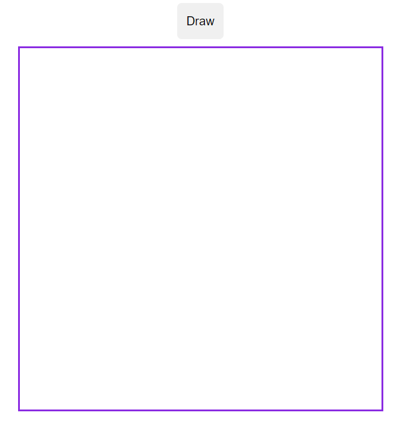
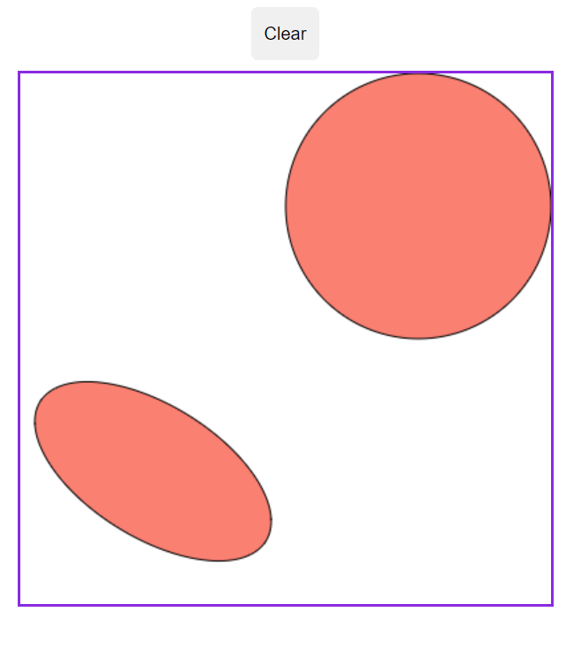

# Asessment: Javascript

### Description (original problem statement)

> Write a web page with a 400x400 pixel canvas and a single button. Using jquery to listen for the button click event, draw a circle 1/2 the size of the canvas in the upper right-hand corner of the canvas and an ellipse in the lower left-hand corner of the canvas. Fill both the circle and the ellipse.

### Approach

This project involved only a small amount of javascript so the entire webpage was packaged in a single
html file (`canvas.html`) with inline javascript.

Jquery was used as requested and was loaded via script tag in the HTML page header block.

A single state variable was used (`bool:dataShown`) so that the user can toggle between a clean canvas and one with the shapes drawn.

The ellipse was drawn in the lower-left quadrant as requested, and I gave it a random orientation to spice it up. ;-)

### Usage

The web page is viewed by pointing a browser at the html file `canvas.html`.

### Sample Output (Screenshots)

