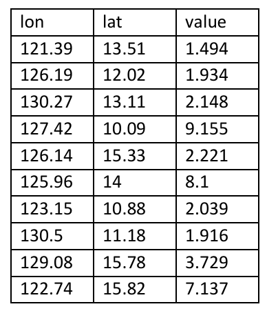
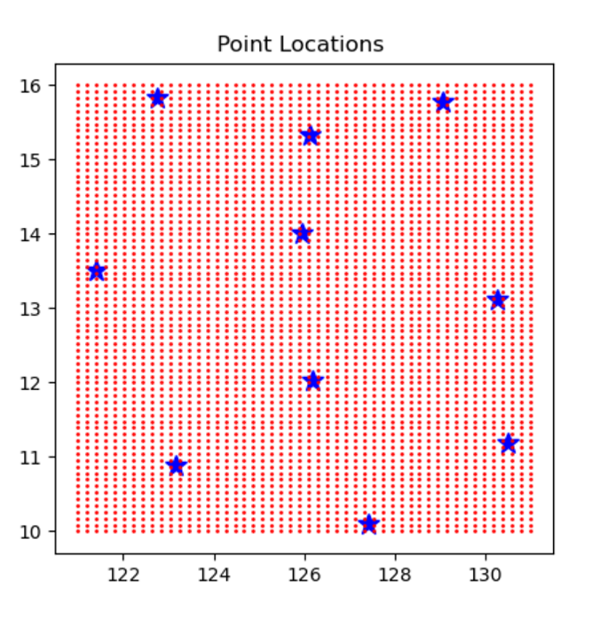
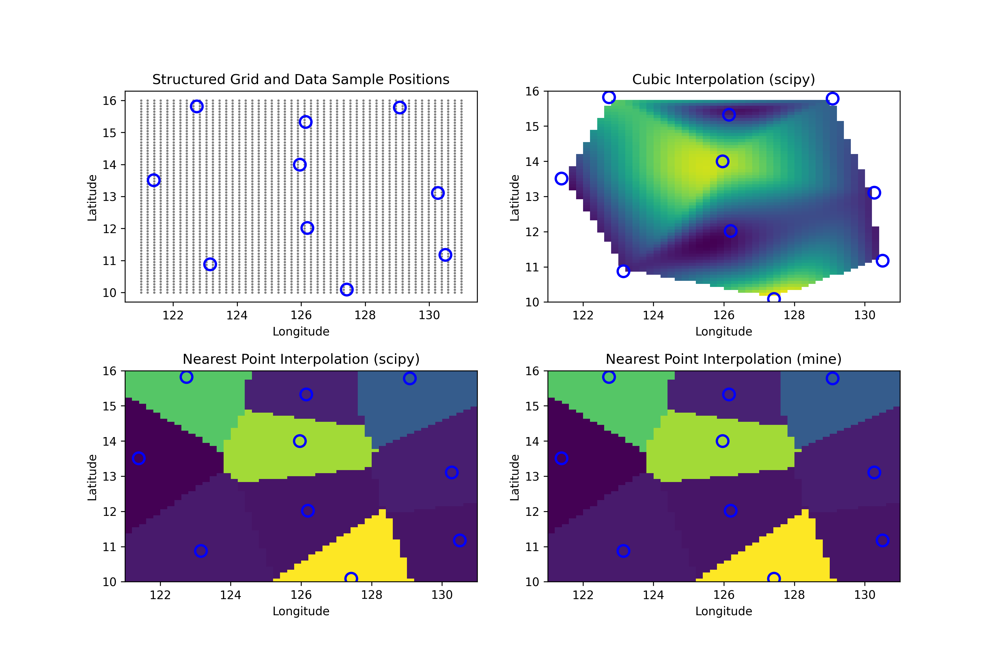

# Assessment: Interpolation

### Description (original problem statement)

> Using any language and plotting packages you like, interpolate the given point location values to a structured grid of longitude and latitude locations. This task will ask the candidate to implement a procedure that interpolates known grid points and values to a structured grid.



> You are free to choose any interpolation method you like.  The spatial grid should have 50 rows and 70 columns with a longitude range [121.0, 131.0] and latitude range [10.0, 16.0].  Provide a plot of your results - including a short summary on the interpolation procedure you implemented.

> The plot below just illustrates the known value locations (blue) and the grid point locations (red), to be
interpolated.




### Approach

A simple nearest point interpolation method was implemented and compared to the nearest and cubic interpolation routines provided by the scipy package.

A nice feature of the nearest point interpolation is that it can be used to stably perform extrapolation and so is easier to interpolate over a grid extending beyond the sample points. For comparison, cubic interpolation performs poorly when used to extrapolate beyond the convex hull of sample points and so is generally not used for such cases (see plot below).

### Usage

The program requires the numpy, matplotlib and scipy packages. These can be installed using `pip` and the `requirements.txt` file included in the folder:

```
> pip -r requirements.txt
```

The program can be run from the command line using the python interpreter:

```
> python ./interpolate.py
```

and will generate a single output file called "interpolate_samples.png" (show below).


### Sample Output (Screenshots)

<p>
Figure. <b>Top-left</b>: location of structured grid (grey) and data sample points (blue circles). <b>Top-right</b>: cubic interpolation using scipy's griddata routine. <b>Bottom-left</b>: nearest point interpolation using scipy's griddata routine. <b>Bottom-right</b>: linear interpolation using a hand-coded nearest point interpolation routine.
</p>




