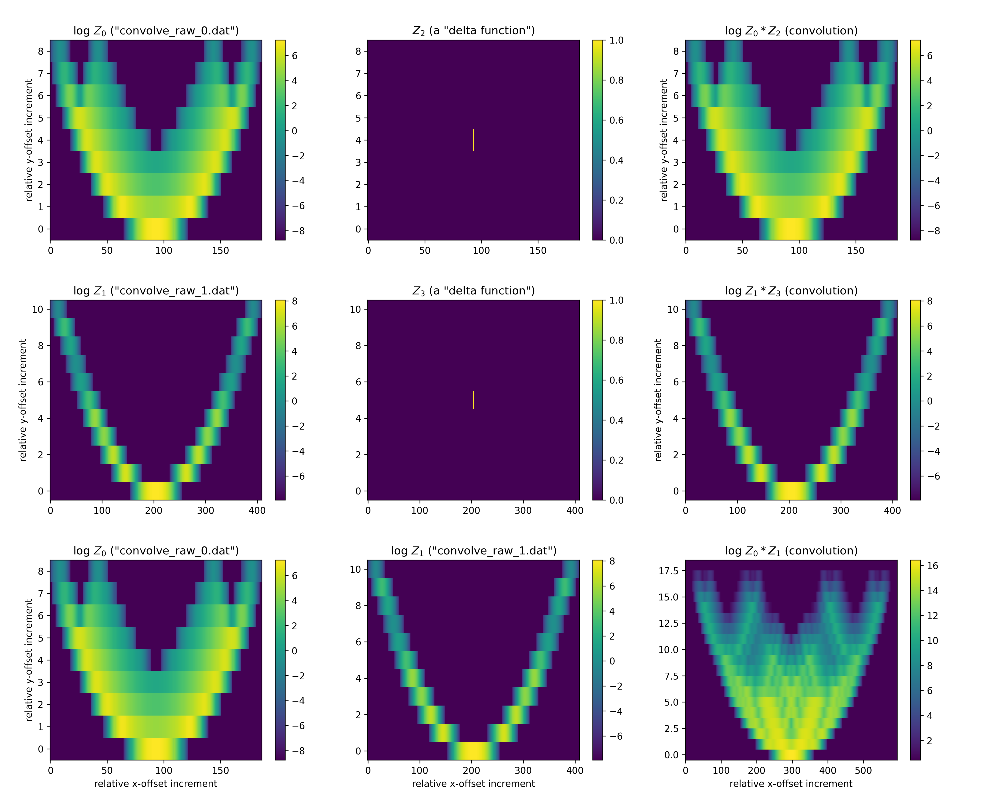

# Assessment: Convolution

### Description (original problem statement)

> "convolve_raw_*.dat" (attached) have data arranged in 3 columns.
> 1) Column 1 and 2 designate x and y coordinates respectively.
> 2) Column 3 is the main data defined at the corresponding (x, y) points.
> 3) Compute the 2-d convolution of these data and provide visualization.
> 4) Use any programming language or library as necessary.

### Approach


#### 1. Re-sample the Data into 2D Array

Inspection of the data in the input files shows that it is from a regular grid but is only sparsely covered (i.e., it is not evenly sampling a structured grid). Therefore, to work with it more easily it will first be copied into a regular numpy 2D array. Because of the small size of the required arrays (e.g., 187x9 and 409x11 for the two files), a regular numpy ndarray will be used rather than a sparse matrix. Finally, the data is padded with 0 values where not defined in the input files.

#### 2. Convolution and Testing

The `scipy.signal.convolve2d` function from the `scipy` package is used to compute the 2d convolution. In order to test that the convolution function is operating as expected, convolution with an approximate delta function, i.e., a 2D array with a single non-zero value of 1.0 in a central location, is investigated as a first step. The convolution of the input data and the approximate delta function should act as an identity operation and return the original image, as it was (see figure below).


#### 3. Data Presentation

The data values have high dynamic range so that it is visualized on a log (base 10) scale in the sample output figure shown below.


### Usage

The program requires the numpy, matplotlib, and scipy packages which can be installed using the provided requirements.txt file and pip.

```
> pip install -r requirements.txt
```

The program is run on the command line using the python interpreter:

```
> python ./convolve.py
```

and it produces a single output file named *convolve.png* in the same directory.


### Result

The below **figure** (*convolve.png*), which is produced by the *convolve.py* program, shows both the test convolutions (top and middle rows) and the final result (bottom row).


The **first and second rows** show that we can recover the original data set after convolving it with an effective delta functions.

The **bottom row** shows the convolution of the two input files. The result is intuitive in that the pattern of the smaller scale data set signal (*convolve_raw_0.dat*) appears to be "stamped" over the larger one (*convolve_raw_1.dat*) -- and the resulting amplitude can be seen to correspond to the product of the input signals. The log scale in each image presents a range of 16 orders of magnitude using the signal peak as the upper limit.

The **positional coordinates** are presented in this figure in terms of spatial increments due to the otherwise large aspect ratio of the coordinates covered. These relative offset positions are scaled by the regular grid spacing units disiscussed above and derived from the raw data (i.e., with dx ~ 0.04, dy ~ 0.000333375) and are origin shifted to the input xmin and ymin positions for each data set.



